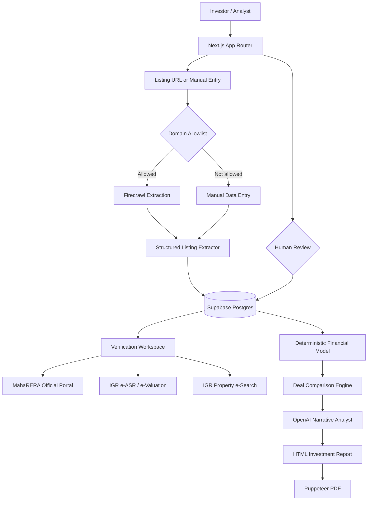
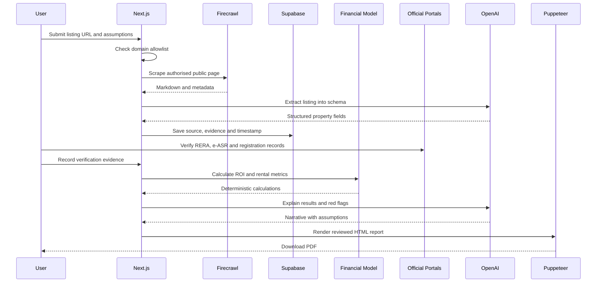

<div align="center">

# 🏙️ EstateWise AI

### Maharashtra Real-Estate Deal Analysis with Transparent Financial Models and Official Verification Workflows

Collect authorised listing data, compare properties by location and budget, estimate rental metrics, flag missing evidence, verify Maharashtra project details through official portals, and generate investor-review PDF reports.

**Next.js • Firecrawl • OpenAI • Supabase • PostgreSQL • Puppeteer • TypeScript**

> Educational decision-support only. Not financial, legal, tax, valuation, lending, or investment advice. All calculations are estimates based on user-provided or cited inputs and require independent professional verification.

</div>

---

## 🌟 Why EstateWise?

Real-estate listings show asking prices and marketing claims, but serious comparison requires more:

- Registration and promoter details
- Project status and completion timeline
- Approved-plan evidence
- Carpet area versus advertised area
- Comparable price per square foot
- Expected rent and vacancy
- Maintenance and transaction costs
- Rental yield and cash flow
- Data freshness and source traceability
- Red flags and missing documents

EstateWise separates **listing facts**, **official-verification evidence**, **user assumptions**, and **calculated estimates** so an AI model cannot silently present assumptions as facts.

## ⚠️ Important Scope

EstateWise does **not** determine that a property is legally approved, guaranteed, safe, profitable, or suitable for purchase.

MahaRERA's official portal provides public search areas for registered, revoked, and mapped projects, along with complaints, orders and project-progress resources. Registration should be treated as a regulatory verification input, not a guarantee of construction quality, title, returns, possession, or suitability. citeturn34search78turn34search79turn34search80

The Maharashtra Department of Registration and Stamps provides official e-ASR/e-Valuation and e-Search services. The e-ASR pages themselves describe rate information as indicative and advise users to verify rates through the official system; the property transaction e-Search service is intended to help users review registration data. citeturn34search96turn34search98turn34search99turn34search101

## ✨ What the Project Does

- Accepts listing URLs from user-approved domains
- Uses Firecrawl to extract clean page content
- Converts listing content into a strict structured schema
- Stores source URL, retrieval timestamp and evidence snippets
- Filters properties by Maharashtra location and budget
- Calculates price per square foot, gross yield, net yield and cash flow
- Compares deals side by side
- Flags missing RERA ID, area ambiguity, stale data and unrealistic assumptions
- Links users to official MahaRERA, IGR e-ASR and e-Search verification
- Stores manual verification status and evidence
- Generates an A4 PDF investment-review report with Puppeteer
- Keeps AI narrative separate from deterministic calculations

Firecrawl's scrape API can return clean markdown, structured data and screenshots from webpages, but developers remain responsible for site terms, robots rules, rate limits, permissions and data licensing. EstateWise therefore uses an explicit domain allowlist and does not bypass logins, paywalls, CAPTCHAs or access controls. citeturn34search84turn34search85turn34search86

Puppeteer can render HTML pages to PDF with `Page.pdf()`, including print CSS, fonts and page layout. citeturn34search90turn34search93

## 🏗️ Architecture



## 🔄 End-to-End Pipeline



## 🧭 Maharashtra Verification Workflow

```text
Listing Claims
    ↓
RERA Number Present?
    ├── No → Flag missing registration evidence
    └── Yes → Open official MahaRERA search
                 ↓
          Verify project / promoter / status / dates
                 ↓
          Record evidence and retrieval date

Property Location + Survey / CTS / Gat / Plot Details
    ↓
Open official IGR e-Search
    ↓
Review registration records independently

District + Taluka + Village + Property Category
    ↓
Open official e-ASR / e-Valuation
    ↓
Record applicable official rate reference

Approved Plans / Area / Title / Encumbrances
    ↓
Request source documents
    ↓
Independent advocate, architect, valuer and lender review
```

The application intentionally links to official portals instead of pretending that a listing scrape proves RERA compliance, title, sanctioned-plan approval or market value. MahaRERA and IGR remain the authoritative public sources for their respective records. citeturn34search78turn34search80turn34search96turn34search101

## 📊 Financial Model

All formulas are deterministic TypeScript functions. AI is used only to explain outputs, not to calculate them.

### Price per square foot

```text
price_per_sqft = purchase_price / carpet_area_sqft
```

Carpet area is preferred. If only built-up or super built-up area is available, the metric is flagged as not directly comparable.

### Gross rental yield

```text
annual_rent = expected_monthly_rent × 12
gross_yield = annual_rent / total_acquisition_cost × 100
```

### Net operating income

```text
vacancy_loss = annual_rent × vacancy_rate
annual_operating_cost = maintenance + property_tax + insurance + management + repairs
net_operating_income = annual_rent - vacancy_loss - annual_operating_cost
```

### Net rental yield

```text
net_yield = net_operating_income / total_acquisition_cost × 100
```

### Leveraged annual cash flow

```text
annual_debt_service = monthly_emi × 12
annual_cash_flow = net_operating_income - annual_debt_service
```

### Cash-on-cash return

```text
cash_invested = down_payment + stamp_duty + registration + brokerage + fit_out
cash_on_cash_return = annual_cash_flow / cash_invested × 100
```

### Five-year scenario value

```text
future_value = purchase_price × (1 + appreciation_rate)^years
```

Appreciation is always a user-defined scenario, never a guaranteed prediction.

## 🚩 Red-Flag Engine

EstateWise flags evidence gaps and model risks, including:

- Missing or malformed MahaRERA registration number
- Official verification not completed
- Project shown as revoked, lapsed or inconsistent by user-entered verification
- Listing area type missing or not carpet area
- Price excludes material costs or taxes
- Rate per square foot far outside supplied comparable range
- Expected rent unsupported by comparable evidence
- Rental yield dependent on zero vacancy
- Possession date inconsistency
- Missing approved-plan evidence
- Missing occupancy or completion evidence for a completed project
- Duplicate listing with conflicting price or area
- Source page is stale or unavailable
- Project name and promoter name mismatch
- Unrealistically high appreciation assumption
- Negative leveraged cash flow

A flag means “investigate”, not “reject automatically”.

## ⚖️ Side-by-Side Deal Comparison

```text
Deal A vs Deal B vs Deal C

Asking Price
Total Acquisition Cost
Carpet Area
Price / Carpet Sq Ft
Expected Monthly Rent
Gross Yield
Net Yield
Monthly EMI
Annual Cash Flow
Cash-on-Cash Return
RERA Verification Status
Approved-Plan Evidence
Comparable Evidence Count
Red Flags
Data Freshness
```

## 🧠 Structured Listing Schema

```json
{
  "title": "2 BHK Apartment",
  "location": {
    "state": "Maharashtra",
    "district": "Pune",
    "locality": "Baner"
  },
  "priceInr": 12500000,
  "areaSqft": 850,
  "areaType": "carpet",
  "bedrooms": 2,
  "bathrooms": 2,
  "projectName": "Example Project",
  "promoterName": "Example Developer",
  "reraNumber": "PXXXXXXXXXXX",
  "possessionDate": null,
  "sourceUrl": "https://allowed-listing.example/property",
  "retrievedAt": "2026-09-05T00:00:00Z",
  "confidence": 0.82,
  "missingFields": []
}
```

## 🔐 Scraping and Data Governance

- Users submit only pages they are permitted to access
- Domain allowlist blocks arbitrary scraping
- No login automation
- No CAPTCHA bypass
- No paywall bypass
- No personal contact data extraction
- No automatic crawling of official government portals
- Source URL and retrieval time are preserved
- Extracted claims are not treated as verified facts
- Firecrawl content is passed through schema validation
- Users can enter data manually when scraping is not permitted

## 🛠️ Technology Stack

### Frontend

- Next.js App Router
- React
- TypeScript
- Responsive deal-comparison UI

### Data acquisition

- Firecrawl public-page extraction
- Manual property entry
- Source evidence and timestamps

### AI

- OpenAI structured listing extraction
- Red-flag explanation
- Report narrative generation
- No AI arithmetic

### Financial modelling

- Deterministic TypeScript functions
- EMI, yields, cash flow and scenarios
- Explicit assumptions and sensitivity cases

### Data and reports

- Supabase Postgres
- Row Level Security templates
- Puppeteer PDF generation
- Print-optimised HTML reports

## 📁 Project Structure

```text
estatewise-ai/
├── app/
│   ├── api/
│   │   ├── analyse/route.ts
│   │   ├── listings/route.ts
│   │   ├── reports/[id]/route.ts
│   │   └── scrape/route.ts
│   ├── compare/page.tsx
│   ├── verification/page.tsx
│   ├── globals.css
│   ├── layout.tsx
│   └── page.tsx
├── components/
│   ├── deal-card.tsx
│   ├── metric-panel.tsx
│   ├── red-flags.tsx
│   └── verification-checklist.tsx
├── lib/
│   ├── extraction.ts
│   ├── finance.ts
│   ├── firecrawl.ts
│   ├── openai.ts
│   ├── pdf.ts
│   ├── schemas.ts
│   └── supabase-admin.ts
├── supabase/migrations/001_estatewise.sql
├── tests/
│   ├── finance.test.ts
│   └── redflags.test.ts
├── .env.example
├── Dockerfile
├── package.json
└── README.md
```

## ⚡ Quick Start

### Prerequisites

- Node.js 20+
- npm
- Supabase project
- OpenAI API key
- Firecrawl API key
- Chrome/Chromium for Puppeteer PDF generation

### 1. Clone

```bash
git clone https://github.com/sgt-9304/EstateWise-AI.git
cd EstateWise-AI
```

### 2. Install

```bash
npm install
```

### 3. Configure

```bash
cp .env.example .env.local
```

Windows:

```powershell
copy .env.example .env.local
```

### 4. Apply database migration

Run in Supabase SQL Editor:

```text
supabase/migrations/001_estatewise.sql
```

### 5. Start

```bash
npm run dev
```

Open `http://localhost:3000`.

## 🔧 Environment Variables

```env
NEXT_PUBLIC_SUPABASE_URL=
NEXT_PUBLIC_SUPABASE_ANON_KEY=
SUPABASE_SERVICE_ROLE_KEY=
OPENAI_API_KEY=
OPENAI_MODEL=gpt-5-mini
FIRECRAWL_API_KEY=
ALLOWED_LISTING_DOMAINS=example.com,another-example.com
PUPPETEER_EXECUTABLE_PATH=
MAX_REPORT_DEALS=5
```

Do not commit `.env.local`.

## 🔌 API Routes

### Scrape an allowed listing

```http
POST /api/scrape
```

```json
{
  "url": "https://allowed-domain.example/property/123"
}
```

### Save or manually enter a listing

```http
POST /api/listings
```

### Analyse a deal

```http
POST /api/analyse
```

```json
{
  "purchasePrice": 12500000,
  "carpetAreaSqft": 850,
  "expectedMonthlyRent": 42000,
  "vacancyRate": 0.08,
  "annualMaintenance": 60000,
  "annualPropertyTax": 18000,
  "insurance": 6000,
  "annualRepairs": 25000,
  "managementRate": 0,
  "stampDutyRate": 0.07,
  "registrationCost": 30000,
  "brokerageRate": 0.01,
  "fitOutCost": 300000,
  "downPayment": 3500000,
  "loanPrincipal": 9000000,
  "annualInterestRate": 0.085,
  "loanYears": 20,
  "appreciationRate": 0.05
}
```

### Generate PDF report

```http
GET /api/reports/{analysis_id}
```

## 📄 Investment Report Sections

- Executive summary
- Property facts and source
- Official-verification checklist
- Unverified claims
- Acquisition-cost breakdown
- Rental assumptions
- Deterministic financial metrics
- Comparable-property snapshot
- Red flags and evidence gaps
- Scenario sensitivity
- Questions for promoter or seller
- Questions for advocate, architect, valuer and lender
- Sources, retrieval dates and disclaimer

## 📊 Sensitivity Scenarios

Every report should compare at least:

```text
Conservative
- Lower rent
- Higher vacancy
- Higher operating expense
- Zero or low appreciation

Base
- User-provided assumptions

Optimistic
- Higher rent
- Lower vacancy
- Higher appreciation
```

The optimistic case must never be presented as expected or guaranteed.

## 🧾 Official Maharashtra Verification Links

- MahaRERA official portal: project, promoter, complaints, project status and map resources. citeturn34search78turn34search80
- Maharashtra IGR official portal: registration, e-ASR/e-Valuation and e-Search services. citeturn34search96turn34search98turn34search101
- e-ASR rate information should be verified using the official version and applicable district/taluka/village/category inputs. citeturn34search98turn34search99turn34search100

## ✅ Testing

```bash
npm run test
npm run build
```

Tests cover EMI calculations, yields, cash flow, scoring and red-flag rules.

## 🐳 Docker

```bash
docker compose up --build
```

The Docker image installs Chromium for Puppeteer.

## 🚧 Known Limitations

- Listing data can be incomplete, delayed, duplicated or inaccurate
- Scraping may not be permitted on every website
- MahaRERA and IGR portals may change
- Official records still require human interpretation
- Market comparables require carefully matched micro-market, age, area type and condition
- Rental estimates require actual comparable evidence
- Taxes, stamp duty and charges vary by facts and date
- No title or encumbrance opinion is provided
- No lender underwriting or valuation is provided
- AI explanations can still be wrong
- PDF generation may need hosted Chromium in serverless environments

## 📈 Evaluation Plan

Measure:

- Listing-field extraction accuracy
- Price and area extraction error
- RERA-number extraction precision
- Human verification completion rate
- Comparable-match acceptance rate
- Financial formula test coverage
- Red-flag precision and recall
- AI narrative citation accuracy
- PDF generation success rate
- Data freshness

Do not publish invented ROI accuracy. ROI is a scenario calculation, not a factual prediction.

## 🗺️ Roadmap

- [ ] Maharashtra district and locality explorer
- [ ] Manual MahaRERA evidence capture
- [ ] Approved-plan document checklist
- [ ] e-ASR reference capture
- [ ] Property e-Search evidence workflow
- [ ] Comparable sale/rent evidence upload
- [ ] Map and infrastructure layers
- [ ] Sensitivity tornado charts
- [ ] Mortgage prepayment scenarios
- [ ] Portfolio-level analysis
- [ ] Organisation RBAC
- [ ] Scheduled listing refresh with source rules
- [ ] Report templates for self-use and advisor review

## 🤝 Suggested Contributions

- `good first issue`: Add stamp-duty assumption editor
- `good first issue`: Add area-type warnings
- `finance`: Add prepayment model
- `verification`: Add evidence attachment UI
- `comparison`: Improve comparable matching
- `reports`: Add scenario charts
- `security`: Add full RLS policies
- `scraping`: Add robots and source-policy registry

Do not submit real agreements, identity documents, private seller data, credentials, or confidential property records.

## 📄 License

MIT for the reference code. Source websites, official records and third-party APIs remain subject to their own terms.

<div align="center">

### Collect evidence. Model assumptions. Compare transparently. Verify independently.

**Source • Verify • Calculate • Compare • Report**

⭐ Star the repository if the transparent real-estate analysis architecture is useful.

</div>
